# Manual de alta del comercio gastronómico

Guía paso a paso para darse de alta como comercio gastronómico en Portal 659.

> **Solo gastronomía** — Estos manuales están pensados para comercios de comida. Próximamente sumamos guías para otras verticales.

---

## 1. Entrá a Portal 659

Abrí tu navegador y entrá a **[www.portal659.com.ar](https://www.portal659.com.ar)**. Vas a ver la home del portal.

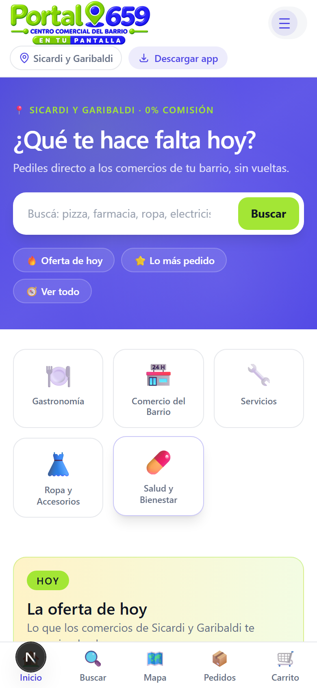

---

## 2. Creá tu cuenta

Tocá **"Registrate"** (o "Sumá tu comercio") para ir al formulario de registro.

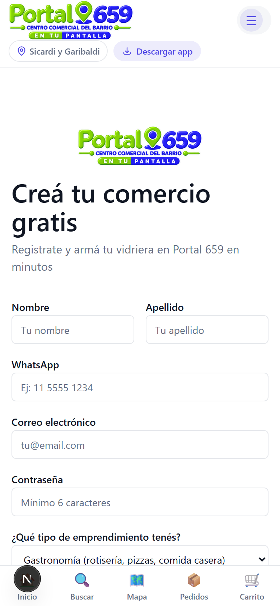

Completá tus datos:

- **Nombre y apellido**: tu nombre real.
- **Nombre del comercio**: cómo se va a llamar tu local (ej: "La Parrilla de Juan").
- **WhatsApp**: tu número con código de área (ej: 11 5555-1234). Por este número te van a escribir los clientes.
- **Email**: tu correo electrónico (lo usás para iniciar sesión).
- **Contraseña**: elegí una contraseña segura.
- **Tipo de comercio**: seleccioná **"Restaurante / Comida"** o la categoría que corresponda.

Tocá **"Crear cuenta"**.

> **Importante:** Revisá tu casilla de email. Te enviamos un mensaje de bienvenida con tu código QR y un link directo para compartir tu menú.

---

## 3. Iniciá sesión

Una vez creada tu cuenta, ingresá con tu email y contraseña.

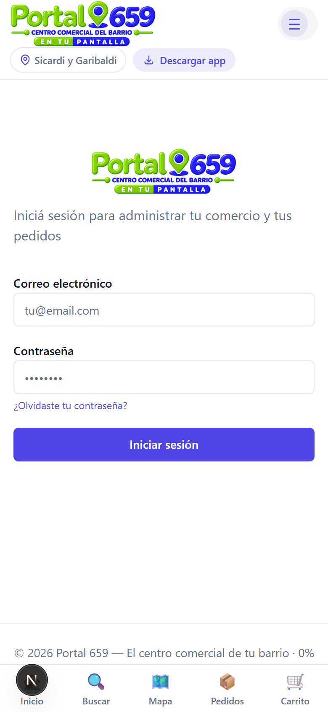

---

## 4. Tu panel de control (Dashboard)

Al entrar, llegás al **Panel de control**. Acá vas a ver:

- Los **pedidos** que te llegan (en tiempo real).
- El **resumen** del día: pedidos nuevos, en preparación, listos y enviados.
- Las **pestanas** principales: Pedidos, Comanda, Mostrador, Mesas y Más.

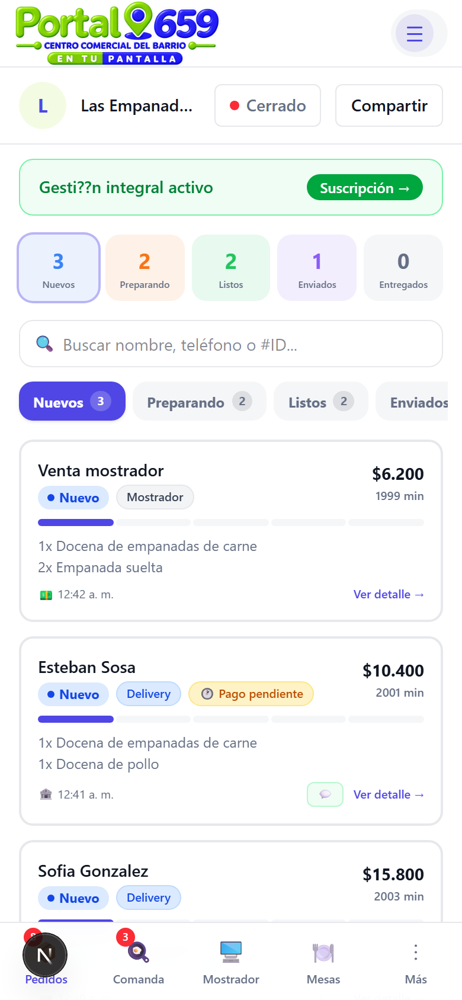

---

## 5. Configurá tu comercio

Tocá la pestaña **"Más"** (⋮) en la barra inferior y después **"Configuración"**.

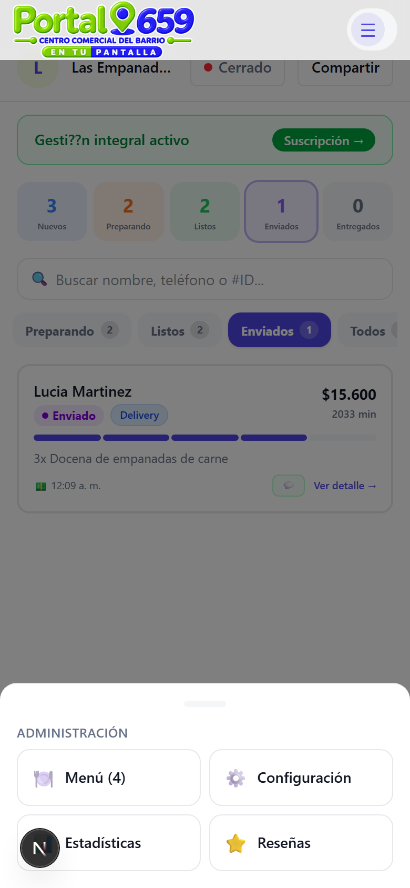

### 5.1 Datos básicos

En la sección **"Tu comercio"** cargá:

- **Nombre del comercio**: cómo se ve en tu micrositio.
- **Categoría**: gastronomía, parrilla, pizzería, etc.
- **Barrio**: zona del comercio.
- **Teléfono de contacto**.

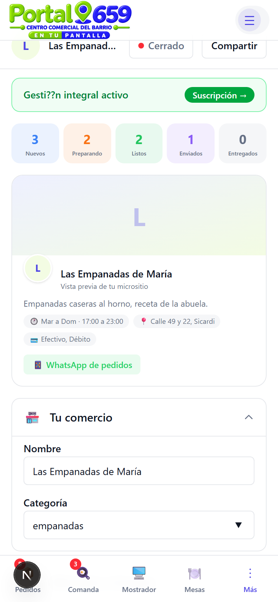

### 5.2 Ubicación y horarios

Expandí **"Ubicación y horarios"** para cargar tu dirección y horarios de atención.

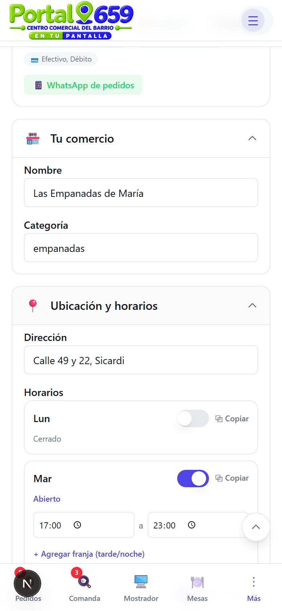

### 5.3 Formas de pago y entrega

En **"Pago y entrega"** configurá:

- **Métodos de pago**: efectivo, transferencia, Mercado Pago.
- **Opciones de entrega**: delivery, retiro en local, ambos.
- **Costo de envío** y **envío gratis desde** (si ofrecés delivery).
- **Datos de transferencia** (alias, CBU, titular).

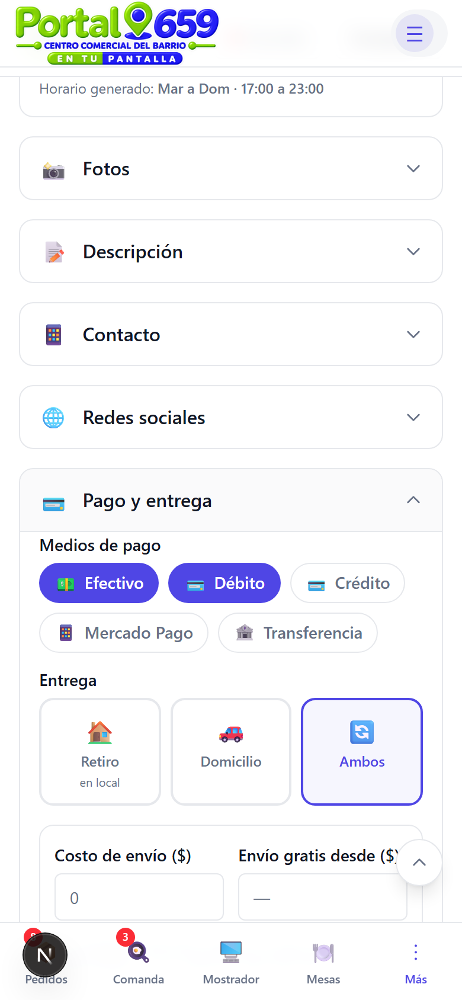

---

## 6. Cargá tu menú

En la sección **"Menú"** de configuración podés:

- Agregar **categorías** (entradas, pizzas, bebidas, etc.).
- Agregar **platos** con nombre, precio, foto y descripción.
- Marcar platos como **"Requiere elaboración"** (para el flujo de cocina).
- Subir una **foto** de cada plato.

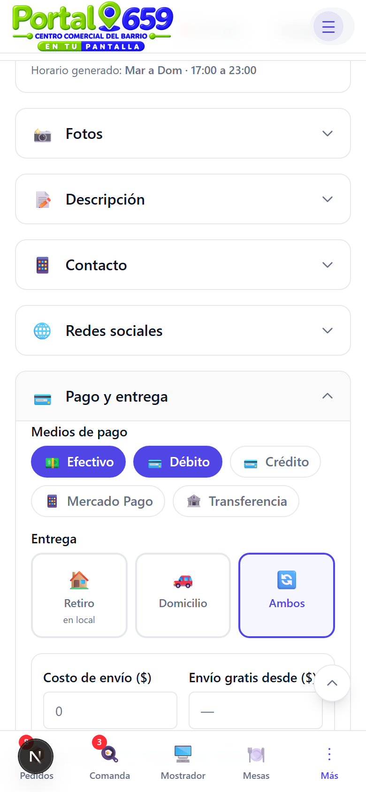

---

## 7. Compartí tu menú

Tocá el botón **"Compartir"** en la parte superior del dashboard. Te aparece un **código QR** y un **link directo** a tu menú.

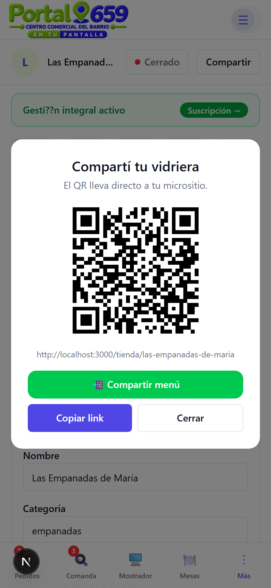

### ¿Cómo lo usás?

- **Código QR**: imprimilo y ponelo en la mesa o en la vidriera. Cuando lo escanean, el cliente ve tu menú completo.
- **Link directo**: compartilo por WhatsApp, Instagram o redes sociales. Ejemplo:
  `https://portal659.com.ar/tienda/tu-negocio?menu=1`

---

## 8. Tu micrositio (vista del cliente)

Con tu link o QR, el cliente ve tu **micrositio**: una página con tu cover, descripción, horarios, menú y botón de WhatsApp.

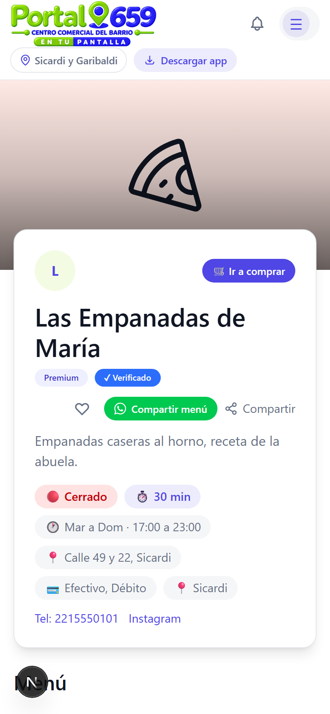

Si acceden con `?menu=1`, se abre directamente en la sección de menú:

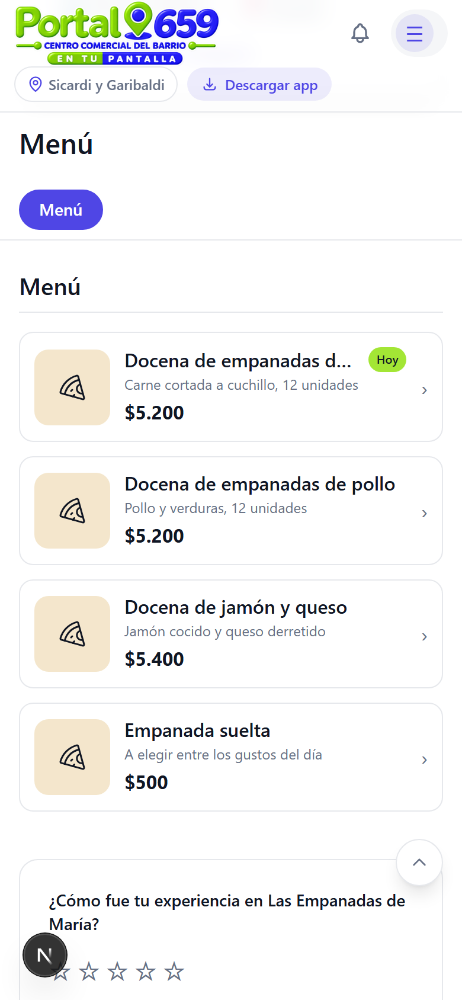

En mobile aparece un **botón fijo de WhatsApp** para que el cliente te escriba directo:

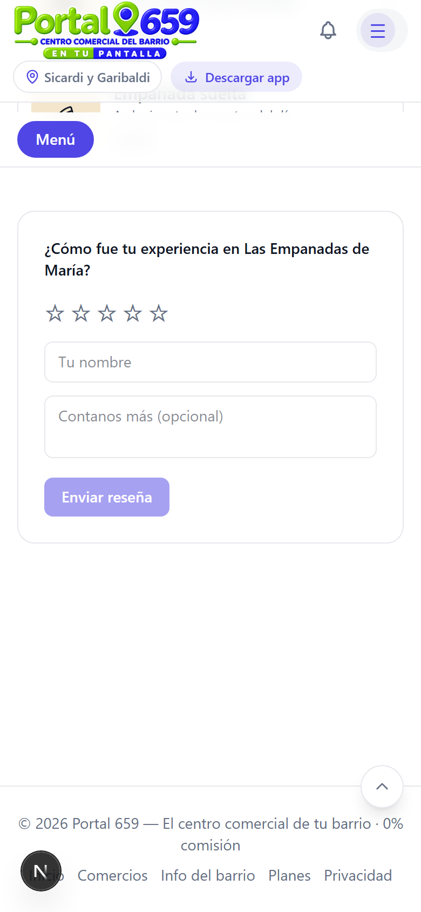

---

## Resumen de pasos

| Paso | Qué hacés |
|------|-----------|
| 1 | Entrás a portal659.com.ar |
| 2 | Te registrás como comercio |
| 3 | Iniciás sesión |
| 4 | Configurás datos, horarios y entrega |
| 5 | Cargás tu menú (categorías + platos) |
| 6 | Compartís tu QR o link |
| 7 | ¡Los clientes te empiezan a escribir por WhatsApp! |

---

## Tips

- **Foto del plato**: una buena foto aumenta las ventas. Usá luz natural y fondo limpio.
- **Descripción breve**: contá qué tiene el plato (ej: "8 unidades, carne cortada a cuchillo").
- **Horarios exactos**: si cerrás un día, actualizá los horarios para que no te escriban fuera de horario.
- **WhatsApp activo**: respondé rápido. Los pedidos se gestionan por WhatsApp.

---

*Siguiente manual: [Recepción de pedidos y delivery](recepcion-pedidos.md)*
