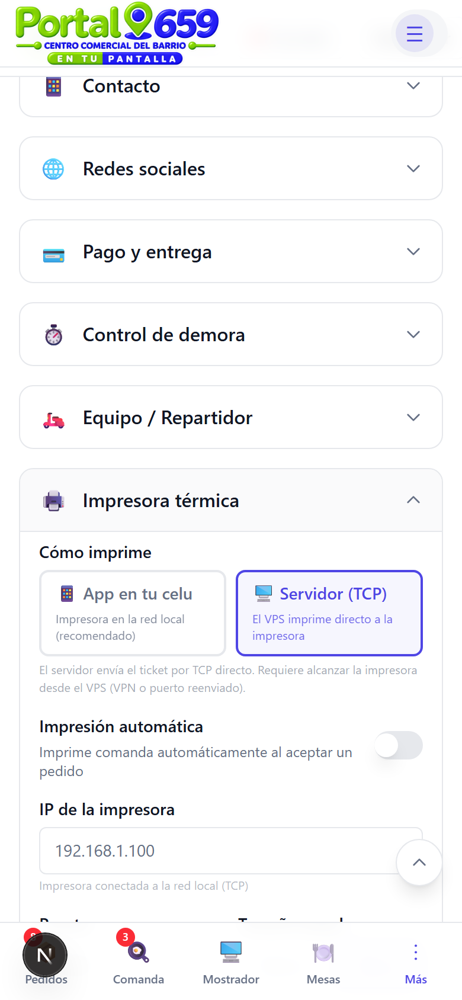
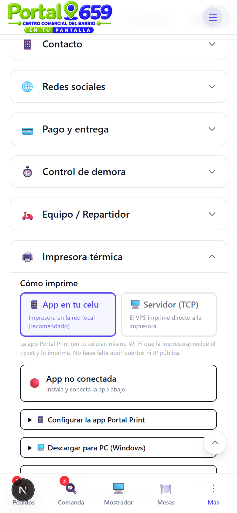
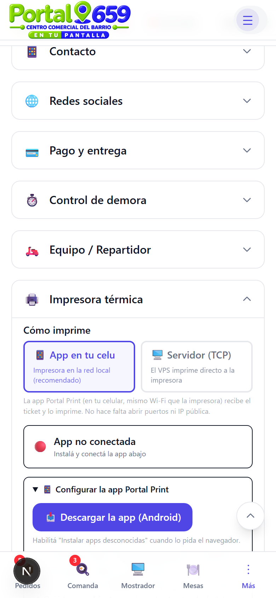
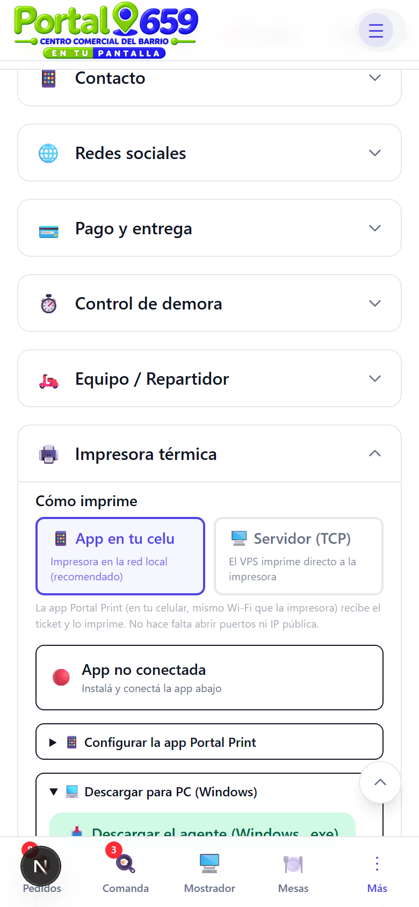
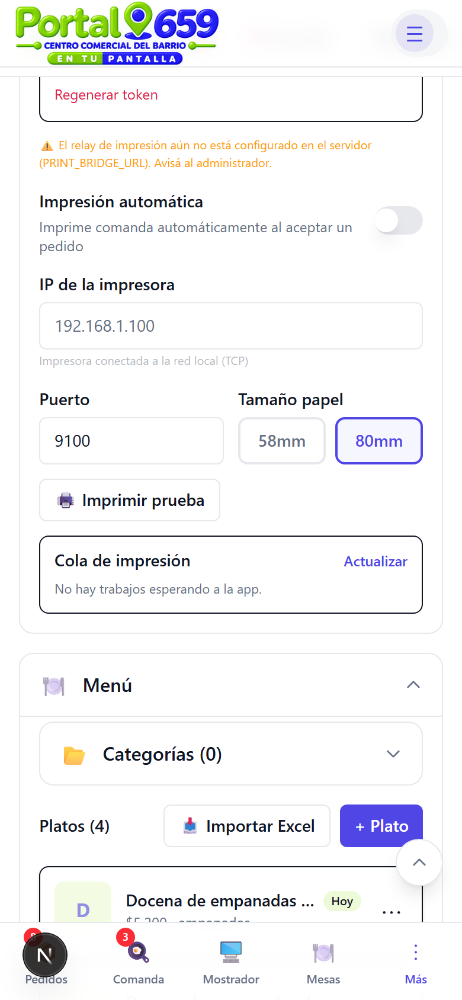
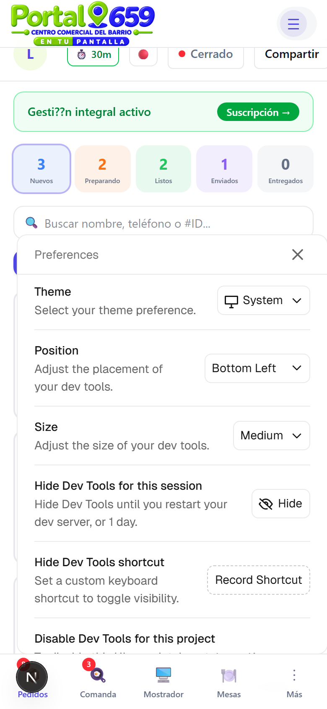
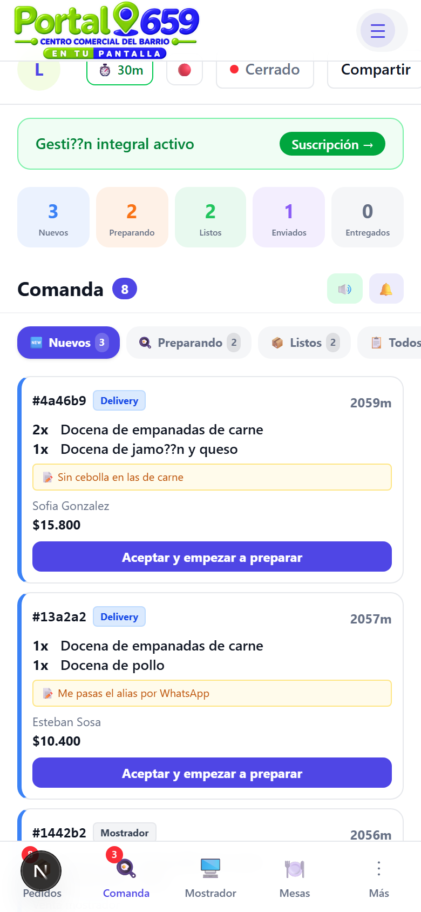
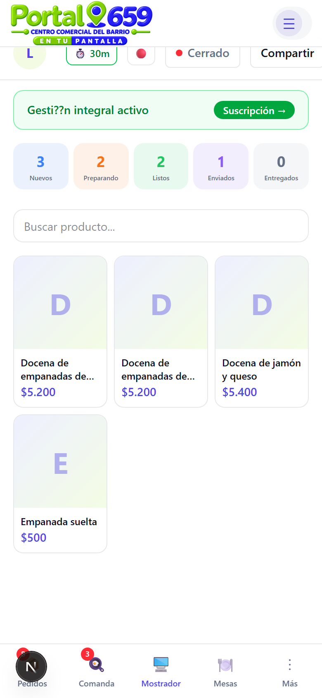
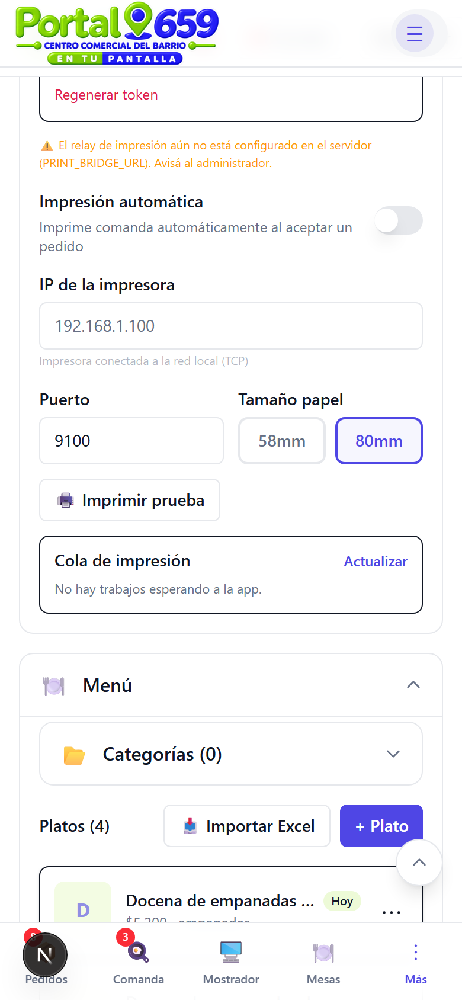
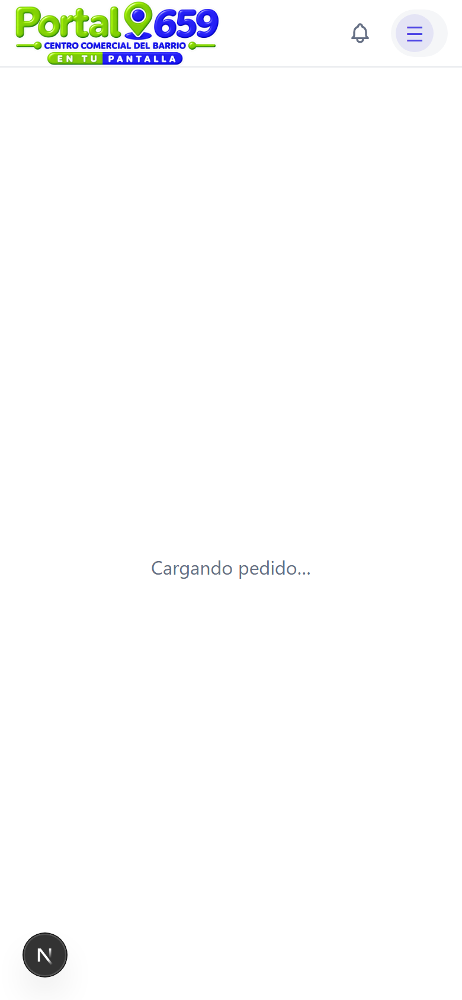

# Manual de configuración e instalación de impresora térmica

Guía completa para configurar e instalar una impresora térmica en Portal 659.

> **Solo gastronomía** — Este manual está pensado para comercios de comida. Próximamente sumamos guías para otras verticales.

---

## 1. Qué necesitás

- Una **impresora térmica** compatible ESC/POS (58mm o 80mm).
- Un **celular Android** o una **PC con Windows** conectados a la misma red Wi-Fi que la impresora.
- Tu comercio debe tener el **plan Gestión** para usar la impresión.

---

## 2. Elegí cómo imprimir

En tu dashboard, entrá a **Configuración → Impresora térmica**. Vas a ver dos opciones:



| Modo | Cómo funciona | Cuándo usarlo |
|------|---------------|---------------|
| **📱 App en tu celu** (recomendado) | La app Portal Print en tu celular recibe el ticket y lo imprime por Wi-Fi | La impresora está en la red local del local |
| **🖥️ Servidor (TCP)** | El VPS envía el ticket directo a la impresora por TCP | La impresora es alcanzable desde el servidor (VPN o puerto reenviado) |

**Recomendación:** usá **App en tu celu**. No necesitás abrir puertos ni tener IP pública.

---

## 3. Opción A: App Portal Print (Android)

### 3.1 Configurar en el dashboard

Seleccioná **"App en tu celu"**. Vas a ver el estado de conexión y el token:



- 🔴 **App no conectada** = la app aún no se conectó (es normal al principio).
- 🟢 **App conectada** = la app está recibiendo tickets.

### 3.2 Descargá e instalá la app

Expandí **"Configurar la app Portal Print"** y tocá el botón de descarga:



1. Descargá el APK tocando **"Descargar la app (Android)"**.
2. Si el navegador lo pide, habilitá **"Instalar apps desconocidas"**.
3. Instalá la app como cualquier otra.

### 3.3 Configurá la app en el celular

Abri la app **Portal Print** en tu celular y seguí estos pasos:

1. **Conectá el celular al mismo Wi-Fi** que la impresora.
2. Pegá el **token** que ves en el dashboard (tocá "Copiar").
3. Ingresá la **IP de la impresora** (la encontrás en la configuración de la impresora o imprimiendo una hoja de prueba desde la impresora misma).
4. Tocá **"Conectar"**.

### 3.4 Configuración crítica del celular

Para que la app funcione sin interrupciones, configurá estos ajustes en tu celular:

> **Estos pasos son obligatorios.** Si no los hacés, el sistema operativo puede cerrar la app y dejar de imprimir.

1. **Ir a Configuración del celular → Aplicaciones → Portal Print → Batería**
   - Seleccioná **"Sin restricciones"** o **"No optimizar"**.
   - Desactivá cualquier **ahorro de batería** para esta app.

2. **Ir a Configuración → Aplicaciones → Portal Print → Datos móviles**
   - Activá **"Permitir uso de datos en segundo plano"**.
   - Desactivá **"Ahorrro de datos en segundo plano"** si existe.

3. **Ir a Configuración → Aplicaciones → Portal Print → Batería**
   - Buscá la opción **"No suspender"** o **"Permitir actividad en segundo plano"** y activala.

4. **Reiniciá el celular** para que todos los cambios se activen.

> **Tip:** dejá el celular enchufado en el mostrador. La app necesita estar abierta y con pantalla encendida (la app ya se encarga de mantener la pantalla activa).

### 3.5 Verificá la conexión

Volvé al dashboard. Si todo está bien, vas a ver el indicador 🟢 **"App conectada"**:


Tocá **"Imprimir prueba"** para verificar que la impresora responde.

---

## 4. Opción B: Agente PC (Windows)

Si preferís usar una PC en lugar del celular:



1. La impresora debe estar en la **misma red** que la PC (por Wi-Fi o cable).
2. Descargá el archivo `.exe` desde el dashboard (botón "Descargar el agente").
3. Ejecutálo (doble clic). La primera vez te pide el **token** y la **IP de la impresora**.
4. Dejá la ventana abierta.

### Autoarranque

Para que el agente arranque solo al prender la PC:

**Opción 1 — Inicio de Windows:**
- Tecleá `Win + R`, escribí `shell:startup` y Enter.
- Mové o copiá el `.exe` a esa carpeta.

**Opción 2 — Tarea programada (CMD como admin):**
```
schtasks /create /tn "Portal Print" /sc onlogon /tr "portal-print-agent.exe"
```

---

## 5. Opción C: Servidor TCP

Si la impresora es alcanzable desde el VPS (misma red, VPN o puerto reenviado):

1. Seleccioná **"Servidor (TCP)"** en el dashboard.
2. Configurá la **IP** y **puerto** (por defecto 9100).
3. El servidor envía los tickets directo por TCP.

> **Nota:** este método requiere que el VPS pueda conectarse a la impresora. No funciona si la impresora está detrás de un router sin port forwarding.

---

## 6. Configuración adicional

En la sección de impresora también podés configurar:



- **IP de la impresora**: la dirección en tu red local (ej: `192.168.1.100`).
- **Puerto**: por defecto `9100` (el estándar para impresoras ESC/POS).
- **Tamaño de papel**: `58mm` o `80mm` (depende de tu impresora).
- **Impresión automática**: si activás esta opción, la comanda se imprime sola al aceptar un pedido.

---

## 7. Probar la impresora

Tocá **"🖨️ Imprimir prueba"** en el dashboard. La impresora debería imprimir un ticket de prueba con:

- Nombre de tu comercio
- Texto "PRUEBA DE IMPRESIÓN"
- Ancho del papel configurado

Si no imprime:
- Verificá que la IP sea correcta.
- Asegurate de estar en la misma red Wi-Fi.
- Revisá que la impresora esté encendida y con papel.

---

## 8. Imprimir desde los pedidos

### Desde el detalle del pedido

Cuando abrís un pedido, vas a ver los botones de impresión:



- **"🖨️ Imprimir comanda"**: imprime el pedido para la cocina (aparece en pedidos que necesitan preparación).
- **"🖨️ Reimprimir ticket"**: imprime el recibo del cliente (en pedidos completados).

### Desde la Comanda (KDS)

En la pestaña **Comanda**, cada ticket tiene un ícono de impresora:



Tocá el ícono 🖨️ para imprimir esa comanda individual.

### Desde el Mostrador (POS)

Al cobrar una venta en el mostrador, la comanda se imprime automáticamente si tenés activada la **impresión automática**:



### Desde Mesas

Al tocar **"Precuenta"** en una mesa, se imprime la cuenta con todos los consumos acumulados.

---

## 9. Cola de impresión

Si la app o el agente no están conectados, los tickets se encolan y se imprimen cuando se reconecten:



- **Actualizar**: recargá la cola para ver si hay trabajos pendientes.
- **Vaciar cola**: borrá todos los trabajos pendientes (útil si la impresora se trabó).

> **Importante:** la cola vive en el servidor. Si el servidor se reinicia, se vacía.

---

## 10. Fallback: imprimir desde el navegador

Si la impresora térmica no está configurada o falla, podés usar el fallback del navegador:



Desde el detalle del pedido, si la impresión térmica falla, se abre una página con el formato del pedido y el botón **"Imprimir"** del navegador. Esto te permite imprimir en cualquier impresora (incluida una impresora de papel común).

---

## Tips y troubleshooting

| Problema | Solución |
|----------|----------|
| 🔴 App no conectada | Verificá que el celular esté en el mismo Wi-Fi que la impresora. Revisá la configuración de batería (paso 3.4). |
| Error al imprimir | Verificá la IP de la impresora. Probá con "Imprimir prueba". |
| La app se cierra sola | Activá "Sin restricciones" en batería y "No suspender". Reiniciá el celular. |
| No sale papel | Revisá que la impresora tenga papel y que el tamaño coincida (58mm o 80mm). |
| Token inválido | Regenerá el token en el dashboard (botón "Regenerar token") y volvelo a pegar en la app. |
| La cola no baja | Tocá "Vaciar cola" y reprintá. Si persiste, reiniciá la app. |

---

> **Recordatorio:** la impresión térmica es una feature del **plan Gestión**. Si no ves los botones de impresión, actualizá tu plan desde la configuración.
