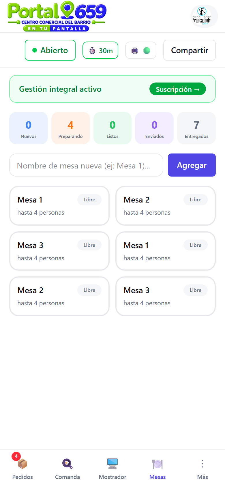
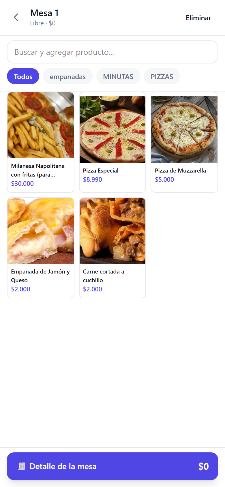
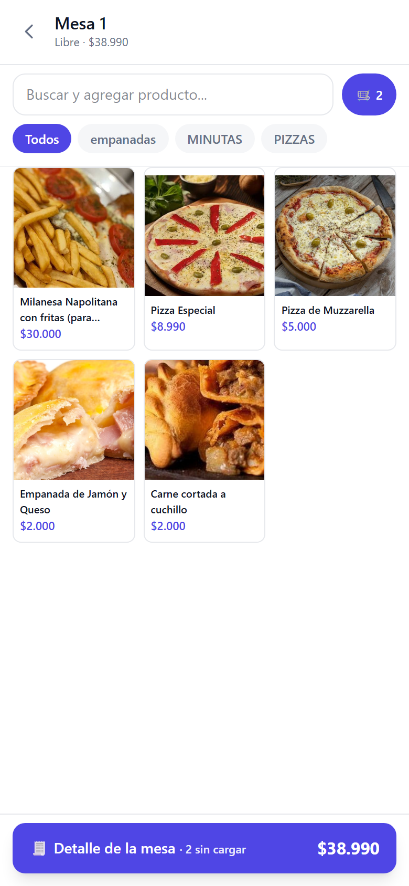
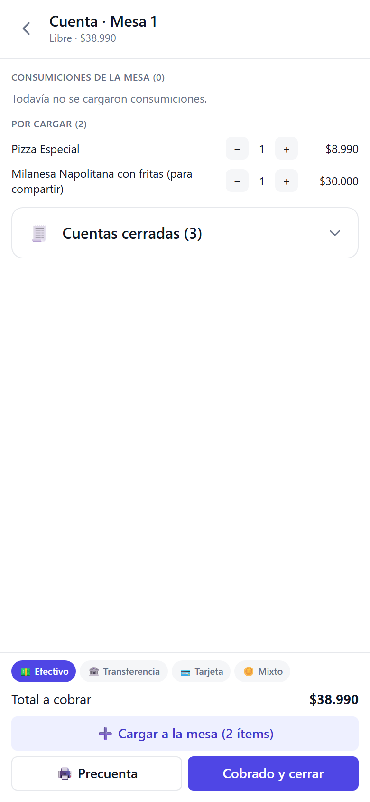
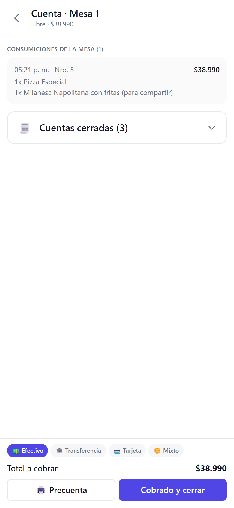
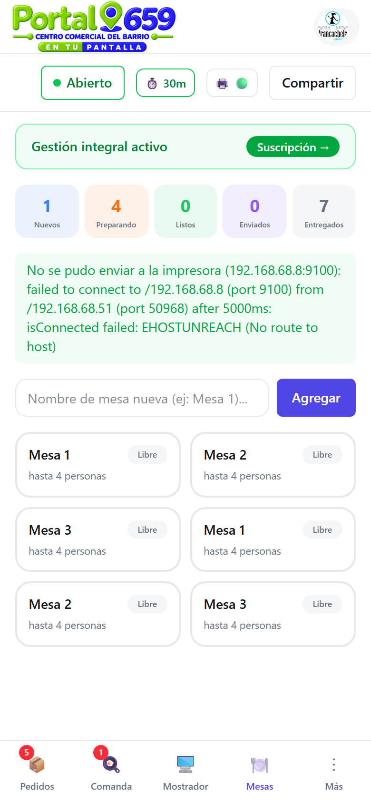

# Manual de mesas

Guía completa para gestionar mesas, consumiciones y cuentas en Portal 659.

> **Solo gastronomía** — Este manual está pensado para comercios de comida. Próximamente sumamos guías para otras verticales.

---

## 1. Qué es Mesas

Mesas es tu sistema de **gestión de mesas y consumiciones**. Desde ahí podés:

- Abrir mesas y cargar consumiciones en tiempo real
- Generar precuentas para el cliente
- Cobrar y cerrar mesas
- Imprimir comanda para la cocina

> **Requisito:** necesitás el **plan Gestión integral** para usar Mesas.

---

## 2. Cómo acceder

Entrá a tu dashboard y tocá la pestaña **🪑 Mesas** en la barra inferior:

---

## 3. Grilla de mesas

La grilla muestra todas tus mesas con su estado:

| Estado | Significado |
|--------|-------------|
| **Libre** | La mesa está disponible, sin consumiciones pendientes |
| **Ocupada** | La mesa tiene consumiciones cargadas esperando cobro |

- Tocá una mesa **libre** para abrirla y empezar a cargar consumiciones.
- Tocá una mesa **ocupada** para ver su cuenta y gestionar el cobro.

---

## 4. Abrir una mesa y cargar productos

### 4.1 Seleccioná la mesa

Tocá cualquier mesa libre. Se abre el **catálogo de productos**:

### 4.2 Buscá y agregá productos

En la parte superior tenés un **buscador** y **chips de categoría** para filtrar:

- **Buscador:** escribí el nombre del producto.
- **Chips:** tocá una categoría para filtrar (ej: "pizzas").
- **"Todos":** muestra todos los productos sin filtro.

Tocá cualquier producto para agregarlo al carrito de la mesa.

### 4.3 Revisá el carrito

En la parte inferior aparece una **barra resumen** con el total de ítems y el monto:

Tocá la barra para ir a la **vista de cuenta** y revisar todo lo cargado.

---

## 5. Vista de cuenta (Detalle de la mesa)

La cuenta muestra dos secciones:

| Sección | Qué muestra |
|---------|-------------|
| **Consumiciones de la mesa** | Ítems ya guardados (confirmados en la base de datos) |
| **Por cargar** | Ítems agregados recientemente que todavía no se guardaron |

Cada ítem tiene botones **−** y **+** para ajustar cantidades. El total se actualiza automáticamente.

---

## 6. Guardar consumiciones

Cuando tengas ítems en "Por cargador", tocá el botón **"➕ Cargar a la mesa (N ítems)"**:

Los ítems pasan de "Por cargar" a "Consumiciones de la mesa". Esto los guarda en la base de datos y los envía a la cocina si tenés impresora configurada.

---

## 7. Generar precuenta

Para mostrarle al cliente cuánto debe, tocá **"🖨️ Precuenta"**:

La precuenta muestra:
- Todos los ítems consumidos con sus precios
- El total a cobrar
- Una leyenda indicando que no es comprobante de pago

La precuesta se imprime si tenés impresora configurada.

---

## 8. Cobrar y cerrar la mesa

### 8.1 Elegí el método de pago

En la parte inferior de la cuenta tenés los métodos de pago:

| Método | Cuándo usarlo |
|--------|---------------|
| **💵 Efectivo** | El cliente paga en efectivo |
| **🏦 Transferencia** | El cliente transfiere por alias o CVU |
| **💳 Tarjeta** | El cliente paga con tarjeta (no se procesa online) |
| **🔀 Mixto** | Combina varios métodos (ej: $10k efectivo + $5k transferencia) |

### 8.2 Confirmá el cobro

Tocá **"Cobrado y cerrar"**. La mesa se libera automáticamente y vuelve a estado **Libre**:

---

## 9. Cuentas cerradas

Las mesas cerradas quedan registradas en la pestaña **"Cuentas cerradas"** dentro de la vista de cuenta. Podés expandirla para ver el historial de cobros de esa mesa.

---

## 10. Tips y buenas prácticas

- **Cargá de a poco:** aggregate los pedidos de a medida que el cliente los va pidiendo. No esperés a que termine de pedir todo.
- **Revisá la precuenta** antes de cobrar para asegurarte de que todo esté correcto.
- **Usá la descripción del producto** para notas especiales (ej: "sin cebolla", "poco cocida").
- **Si tenés impresora**, la comanda se envía automáticamente al guardar consumiciones que requieran cocina.

---

¿Tenés dudas? Escribinos por WhatsApp desde tu dashboard o contactá al soporte.
