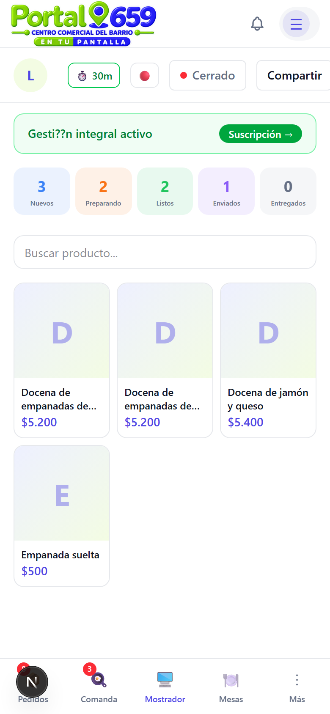
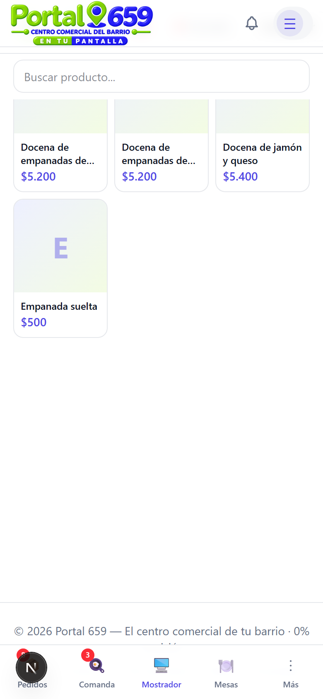
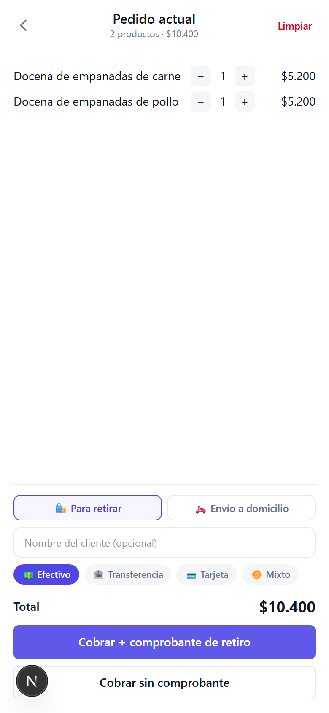
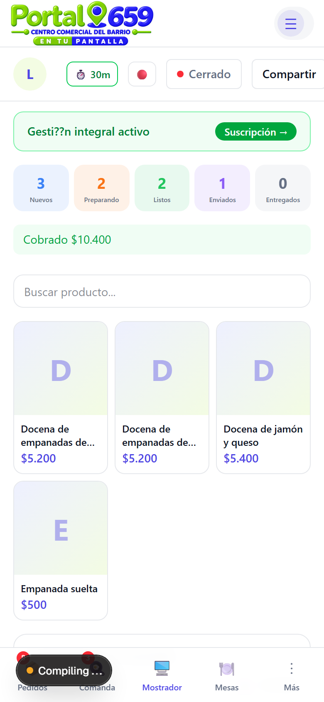

# Manual de pedidos por mostrador

Guía completa para usar el punto de venta (POS) en Portal 659.

> **Solo gastronomía** — Este manual está pensado para comercios de comida. Próximamente sumamos guías para otras verticales.

---

## 1. Qué es el Mostrador

El Mostrador es tu **punto de venta presencial**. Desde ahí podés:

- Buscar y agregar productos al carrito
- Cobrar en efectivo, transferencia, tarjeta o mixto
- Imprimir comanda para la cocina y comprobante de retiro para el cliente
- Registrar envíos a domicilio

> **Requisito:** necesitás el **plan Gestión integral** para usar el Mostrador.

---

## 2. Cómo acceder

Entrá a tu dashboard y tocá la pestaña **🖥️ Mostrador** en la barra inferior:

---

## 3. Buscar productos

En la parte superior tenés un **buscador** y **chips de categoría** para filtrar:

- **Buscador:** escribí el nombre del producto.
- **Chips:** tocá una categoría para filtrar (ej: "empanadas").
- **"Todos"**: muestra todos los productos sin filtro.

---

## 4. Agregar al carrito

Tocá cualquier producto para agregarlo al carrito:

- **Sin modificadores:** se agrega directo con cantidad 1.
- **Con modificadores:** se abre un selector donde elegís las opciones (ej: tamaño, extras). Tocá **"Agregar"** para confirmar.

Si el mismo producto ya está en el carrito, la cantidad se incrementa automáticamente.

---

## 5. Modificar cantidades

En el carrito, cada línea tiene botones **−** y **+**:

- **+** aumenta la cantidad en 1.
- **−** disminuye la cantidad en 1. Si llega a 0, el producto se elimina del carrito.

El total se actualiza automáticamente.

---

## 6. Tipo de pedido

Elegí entre dos opciones:

- **🛍️ Para retirar** (por defecto): el cliente retira en el local.
- **🛵 Envío a domicilio**: enviás el pedido a la dirección del cliente. Si elegís esta opción, aparecen campos obligatorios de **teléfono** y **dirección**.

---

## 7. Datos del cliente

- **Nombre** (opcional): para identificar al cliente en el historial.
- **Teléfono** (obligatorio si es envío): para contactarlo.
- **Dirección** (obligatoria si es envío): para el repartidor.

---

## 8. Método de pago

Elegí una de cuatro opciones:

| Método | Cuándo usarlo |
|--------|---------------|
| 💵 **Efectivo** | Pago en cash (por defecto) |
| 🏦 **Transferencia** | Pago por depósito o transferencia |
| 💳 **Tarjeta** | Débito, crédito o QR |
| 🪙 **Mixto** | Combina métodos (ej: parte cash, parte transferencia) |

---

## 9. Cobrar

Tenés dos opciones:

- **"Cobrar + comprobante de retiro"** (retiro) / **"Cobrar y despachar"** (envío): cobra e imprime un comprobante con el número de retiro.
- **"Cobrar sin comprobante"** / **"Cobrar sin imprimir comprobante"**: cobra sin imprimir nada.

---

## 10. Qué pasa después

Al tocar "Cobrar":

1. Se crea el pedido en el sistema con **canal "Mostrador"**.
2. Si los productos necesitan preparación (ej: cocinar empanadas), se imprime una **comanda** para la cocina automáticamente.
3. Se imprime el **comprobante de retiro** (si elegiste esa opción).
4. El carrito se vacía y aparece un mensaje de éxito.

El pedido aparece en la pestaña **Comanda** (KDS) para que la cocina lo prepare.

---

## 11. Ventas de hoy

Debajo del carrito, la sección **"Ventas de hoy en mostrador"** muestra todos los pedidos del día con:

- Método de pago
- Número de retiro
- Nombre del cliente
- Hora
- Total

### Convertir a domicilio

Si un pedido de retiro necesita enviarse a domicilio, tocá el ícono **🛵** al lado del pedido:

1. Ingresá el **teléfono** del cliente.
2. Ingresá la **dirección** (opcional).
3. Tocá **"Confirmar envío"**.

El pedido se actualiza con el método de envío.

---

## 12. Tips

- **Impresión automática:** si la activás en Configuración → Impresora, la comanda se imprime solo al cobrar.
- **Flujo rápido:** el Mostrador está diseñado para ventas rápidas. No necesitás salir de la pantalla después de cobrar.
- **Pedidos sin cocina:** si vendés productos que no necesitan preparación (ej: bebidas en lata), el pedido se marca como completado al instante.
- **Stock:** si activás control de stock, los productos se agotan automáticamente al venderse.

---

> **Recordatorio:** el Mostrador es una feature del **plan Gestión integral**. Si no ves la pestaña, actualizá tu plan desde la configuración.
