# Manual de recepción de pedidos y delivery

Guía completa para recibir, gestionar y despachar pedidos gastronómicos en Portal 659.

---

## 1. ¿Cómo llegan los pedidos?

Los clientes te escriben por **WhatsApp** haciendo su pedido. Vos lo registrás en el panel de control y lo gestionás paso a paso.

También podés recibir pedidos directamente desde el **carrito online** si tu plan lo permite (plan Gestión o superior).

---

## 2. Tu panel de pedidos

Entrá a tu dashboard en **[portal659.com.ar/vendor/dashboard](https://portal659.com.ar/vendor/dashboard)**.

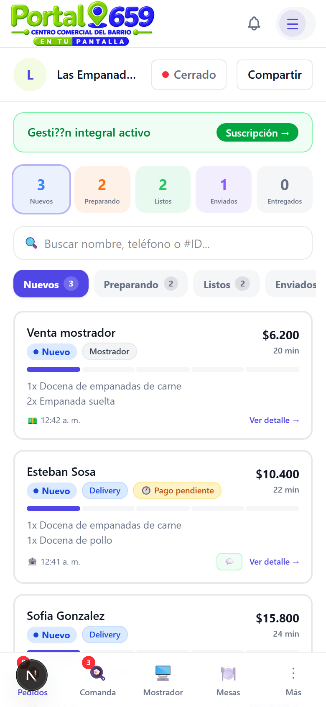

En la parte superior ves el **resumen**:

| Filtro | Qué muestra |
|--------|-------------|
| **Nuevos** | Pedidos recién llegados, esperando tu acción |
| **Preparando** | Pedidos que estás cocinando/empaquetando |
| **Listos** | Pedidos listos para enviar o retirar |
| **Enviados** | Pedidos en camino (delivery) |
| **Entregados** | Pedidos finalizados |

Usá los filtros para ver solo los pedidos de cada estado:

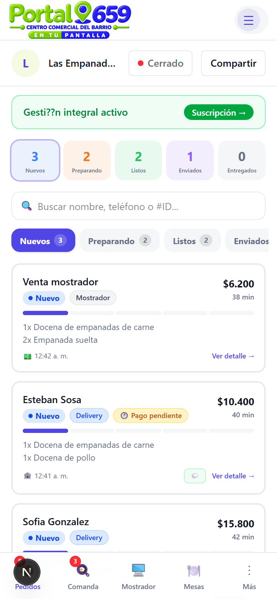

---

## 3. Flujo de un pedido de delivery

### 3.1 Pedido nuevo

Cuando un cliente hace un pedido, aparece como **"Nuevo"** en la lista. Tocá el pedido para ver los detalles.

En el detalle ves:
- **Nombre del cliente** y datos de contacto.
- **Ítems pedidos** (platos, cantidades, precio).
- **Método de entrega**: delivery o retiro.
- **Dirección** (si es delivery).
- **Tiempo estimado**.

### 3.2 Aceptá el pedido

Tocá **"Aceptar y empezar a preparar"**. El pedido pasa a estado **"Preparando"**.

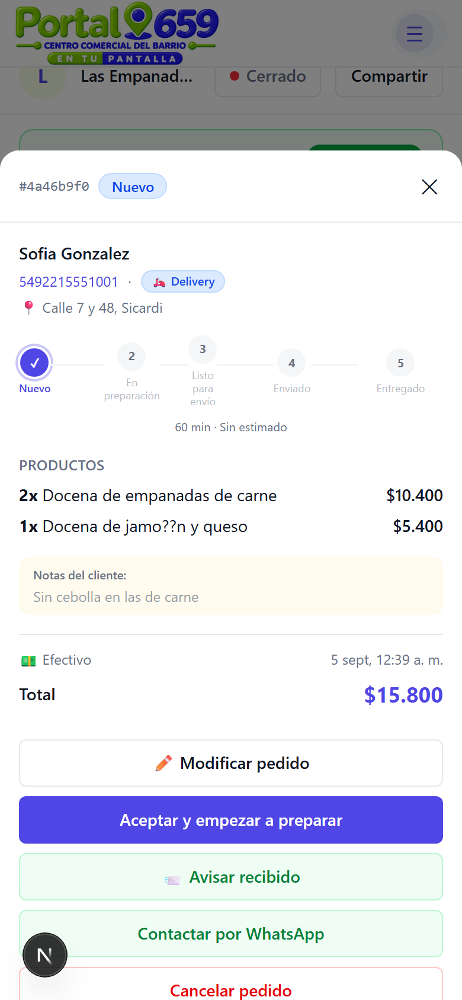

### 3.3 Preparando

Mientras cocinás, el pedido aparece en la pestaña **"Preparando"**.

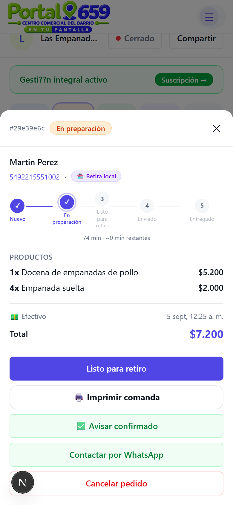

### 3.4 Listo para enviar

Cuando terminás, tocá **"Listo para envío"**. El pedido pasa a estado **"Listo"**.

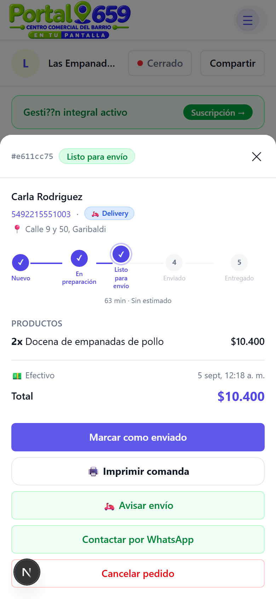

### 3.5 Enviá el pedido

Avisale al cliente que sale el envío. Tocá **"Avisar por WhatsApp"** para enviarle el mensaje con el link de seguimiento.

### 3.6 Pedido enviado

El pedido pasa a **"Enviado"** y el cliente recibe una notificación.

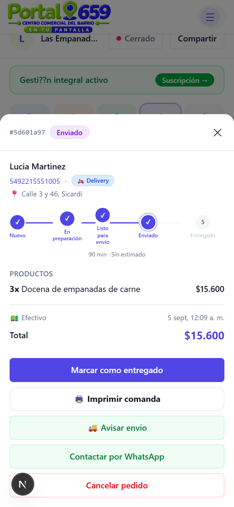

### 3.7 Completado

Cuando el cliente recibe el pedido, tocá **"Marcar como entregado"**. El pedido pasa a **"Completado"**.

---

## 4. Flujo de retiro en local

El flujo es igual pero **sin el paso de envío**:

1. **Nuevo** → Aceptás.
2. **Preparando** → Cocinás.
3. **Listo para retiro** → Avisás al cliente por WhatsApp.
4. El cliente retira y tocás **"Marcar como completado"**.

---

## 5. Pedido con transferencia pendiente

Si el cliente paga por **transferencia bancaria**, el pedido aparece con el aviso **"Pago pendiente"**.

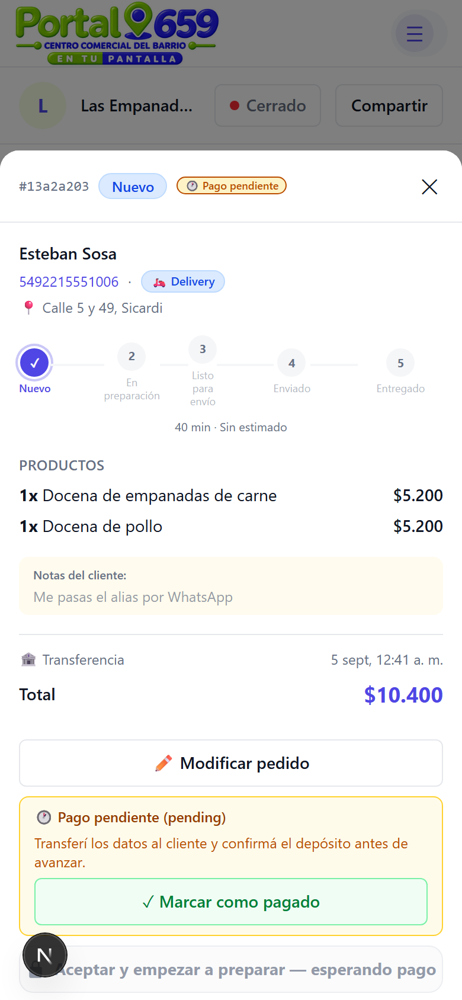

Hasta que no marques el pago como recibido, el pedido **no puede avanzar** (si tenés activada la opción "Bloquear hasta confirmar pago" en Configuración > Pago y entrega).

**Para desbloquear:** abrí el pedido y tocá **"Marcar como pagado"**.

---

## 6. Pedidos en mostrador (venta presencial)

Si vendés en el mostrador (venta directa), el pedido aparece con el método **"Mostrador"**.

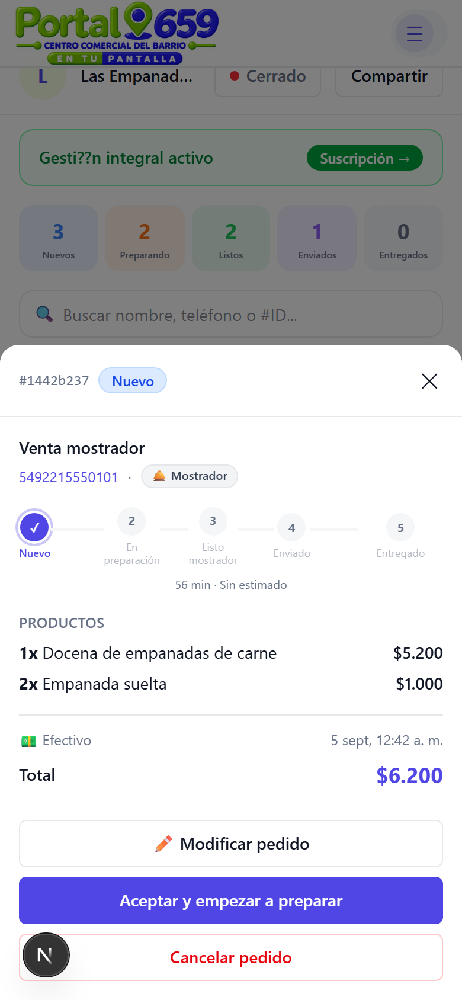

Estos pedidos no tienen dirección ni delivery. Se cobran en el momento y se marcan como completados al entregar.

---

## 7. Pedidos de mesa

Si tu local tiene mesas, los pedidos aparecen con el método **"Mesa"** y el número de mesa.

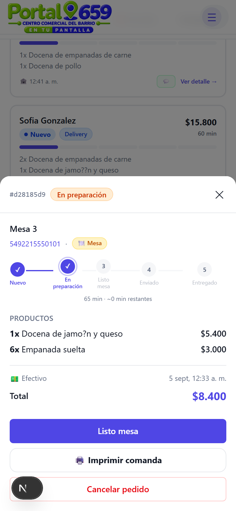

Los pedidos de mesa se acumulan en la cuenta de la mesa hasta que el cliente quiera cerrar.

---

## 8. Comanda (KDS)

La pestaña **"Comanda"** muestra los pedidos que necesitan preparación, organizados por tipo de plato. Es tu pantalla de cocina.

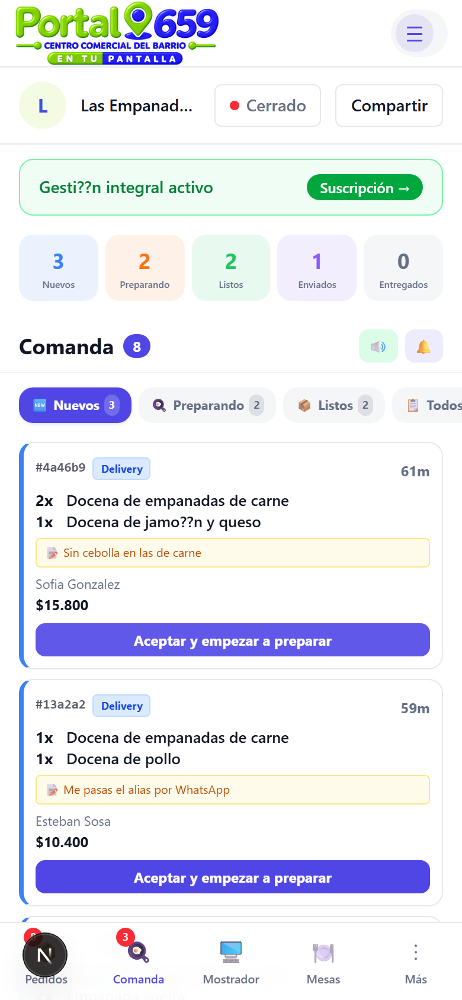

Cada tarjeta muestra:
- **Nombre del cliente** y número de pedido.
- **Ítems** a preparar.
- **Tiempo transcurrido**.
- **Acciones**: pasar al siguiente estado.

---

## 9. Mostrador (POS)

La pestaña **"Mostrador"** es tu punto de venta para ventas presenciales. Desde ahí podés:

- Registrar ventas rápidas.
- Cobrar en el momento.
- Imprimir la precuenta.

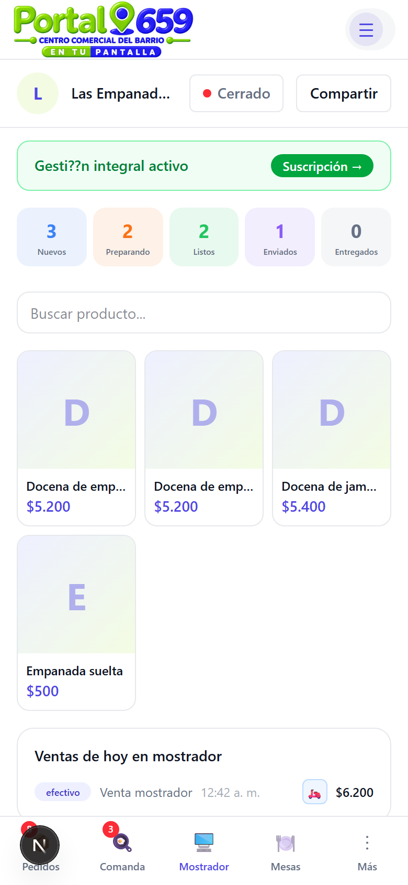

---

## Resumen de estados del pedido

| Estado | Qué significa | Acción del comercio |
|--------|---------------|---------------------|
| **Nuevo** | Recién llegado | Aceptar o rechazar |
| **Preparando** | En cocina | Preparar el pedido |
| **Listo** | Empaquetado | Avisar al cliente |
| **Enviado** | En camino (delivery) | Esperar confirmación |
| **Completado** | Entregado | ¡Listo! |
| **Cancelado** | Rechazado | — |

---

## Tips para una buena gestión

- **Respondé rápido**: los clientes valoran la velocidad.
- **Actualizá el estado**: el cliente recibe notificaciones cuando cambia el estado.
- **Usá la comanda**: si tenés varios pedidos, la pantalla de cocina te ayuda a organizar.
- **Revisá los pagos**: no despachés pedidos sin confirmar el pago (transferencia).
- **Stock**: si activás control de stock, los platos se agotan automáticamente.

---

*Manual anterior: [Alta del comercio](alta-comercio.md)*
